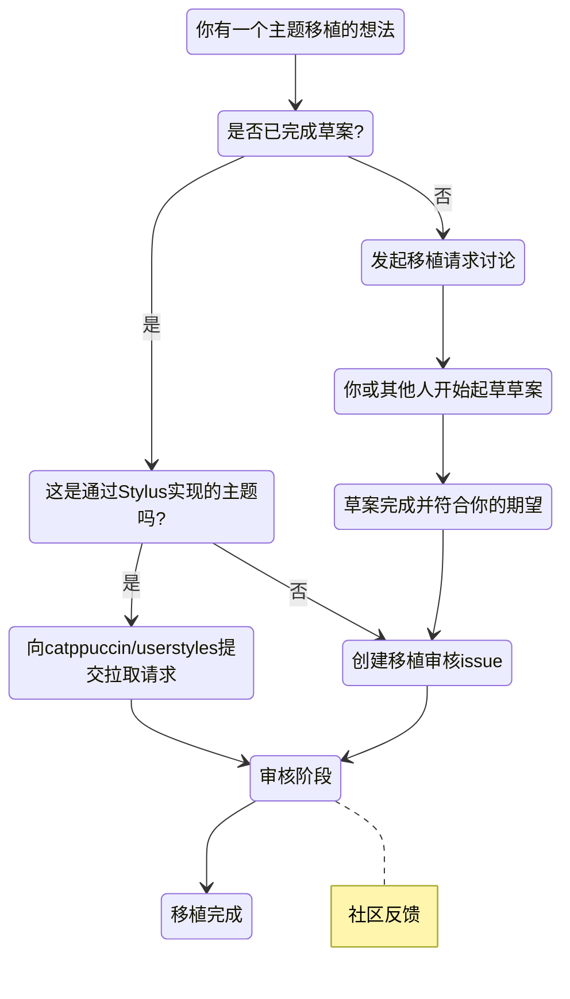

<p align="center">
  <h2 align="center">🧱 移植创作</h2>
</p>

<p align="center">
	提交与创建移植作品的指南
</p>

&nbsp;

### 什么是移植？

移植是将Catppuccin配色方案适配到某个应用程序中使用。可以理解为为程序设计的色彩方案，它会修饰该程序包含的所有UI组件！

### 什么是用户样式？

在Catppuccin语境下，用户样式是指通过[Stylus](https://github.com/openstyles/stylus)为网站定制的移植主题，您可以在[catppuccin/userstyles](https://github.com/catppuccin/userstyles)查看所有Catppuccin用户样式。

> [!IMPORTANT]<br> 
> **所有用户样式都是移植作品，但并非所有移植都是用户样式。**

&nbsp;

### 提交规范

> [!IMPORTANT]<br>
> 所有移植作品必须遵守我们的
> [行为准则](https://github.com/catppuccin/.github/blob/main/CODE_OF_CONDUCT.md)，
> 管理团队保留对组织收录移植作品的最终决定权。

请仔细阅读以下章节，确保您的提交符合我们的规范！

- [工作流程](#workflow) - 查看Catppuccin移植从开始到完成的理想流程！
- [常见问题](#faq) - 不知从何开始？这里能找到您需要的答案！
- [创作指南](#creation) - 使用我们的模板仓库开始创作移植作品！
- [样式规范](#styling) - 已开始移植工作？请确保遵循我们的样式指南！
- [许可协议](#licensing) - 关于组织下移植作品许可的重要信息！
- [维护说明](#maintenance) - 移植作品转入组织后的维护细则！

&nbsp;

### 工作流程



&nbsp;

### 常见问题

**问：我已经完成了一个主题移植，准备提交审核！**

**答：** 已完成的移植审核可以通过[此处](https://github.com/catppuccin/catppuccin/issues/new?assignees=&template=port-review.yml&title=Name+of+the+application%2Ftool%2Fwebsite%2Fetc.)提交issue，我们的[核心团队](https://github.com/catppuccin/community/#current-structure)将会进行审核！

**问：我已经完成了一个用户样式，准备提交审核！**

**答：** 已完成的用户样式请通过[拉取请求](https://github.com/catppuccin/userstyles/compare)提交至[catppuccin/userstyles](https://github.com/catppuccin/userstyles/compare)。更多关于如何贡献用户样式的信息请参考[这里](https://github.com/catppuccin/userstyles/blob/main/docs/userstyle-creation.md)。

**问：我想申请移植某个项目/我已经开始移植工作！**

**答：** 请在主仓库[发起讨论](https://github.com/catppuccin/catppuccin/discussions/new?category=port-requests)！当我们的[核心团队](https://github.com/catppuccin/community/#current-structure)确认移植准备就绪后，该讨论会被转为issue。也欢迎加入我们的[Discord](https://discord.com/servers/catppuccin-907385605422448742)进行分享！

**问：哪些类型的移植不会被接受？**

**答：** 作为社区驱动项目，我们希望为所有用户保持中立环境。因此**我们不接受具有宗教或政治背景的贡献**。当然，我们不反对我们的配色方案被用于这些场景。

&nbsp;

### 创建指南

你可以使用[这个公开模板](https://github.com/catppuccin/template)作为蓝图来创建移植项目。

1. 克隆模板仓库

   ```
   git clone https://github.com/catppuccin/template.git <你的移植项目名称>
   ```

2. 进入克隆的仓库目录

   ```
   cd <你的移植项目名称>
   ```

3. 删除仓库根目录下的 `.git` 文件夹并运行 `git init`。这将避免模板作者显示为你新移植项目的贡献者。  

4. 完成移植项目的其他设置，并将其推送到你的个人仓库！  

&nbsp;  

### 样式规范  

成功创建仓库后，遵循以下样式规范以确保一致性非常重要：  

- 仓库名称必须使用 `短横线小写命名法`（例如 `unreal-engine` 而非 `Unreal Engine`）。  
- 确保默认分支设置为 `main`，这能使仓库与组织内的其他移植项目保持一致。  
- 将图片放置在 `assets/` 目录下。  
  - 图片格式优先选择 `.webp` 而非 `.png`，因为 `.webp` 效率更高且所有主流浏览器均支持。  
- 仓库描述格式为："`<表情符号>` Soothing pastel theme for `<应用名称>`"。  
  - `<表情符号>` 应选择最能代表该应用的 emoji。  
  - `<应用名称>` 需使用正确的大小写格式。  
- 在仓库标签中添加 `catppuccin`、`theme` 和应用名称（如 `unreal-engine`）。  
- 确保已按照[创建步骤](#creation)生成仓库。  
- 确保移植项目的 README.md 按以下规范设置样式：  
  - 更新 [shields.io](https://shields.io/) 徽章链接，指向你的仓库而非模板仓库。  
  - 主预览图应使用 [catwalk](https://github.com/catppuccin/toolbox#-catwalk) 工具生成（参考 [vscode](https://github.com/catppuccin/vscode#catppuccin-for-vscode) 和 [discord](https://github.com/catppuccin/discord#catppuccin-for-discord) 示例）。  
  - 将预览图路径改为[相对链接](https://github.blog/2013-01-31-relative-links-in-markup-files/)。  
  - 在 **致谢** 部分添加你的名字 ❤️  
- 确保元文件使用大写字母命名（如 `README.md`）。  
- 不要添加健康文件（如 `CODE_OF_CONDUCT.md`、`SUPPORT.md`），这些是组织级文件，存放于[此处](https://github.com/catppuccin/.github)。  

&nbsp;  

### 维护说明  

管理团队希望你知道：我们理解提交移植项目可能让人压力倍增。但请放心，**我们并不要求你在项目移交后继续维护**。当然，如果你愿意持续贡献，我们会非常感激。  

当你提交移植项目时，请将其视为共同维护的邀请。这意味着你将与团队协作维护项目！我们的主要目标是保持所有移植项目的质量一致性和可访问性标准。我们也会提供改进建议并协助解决技术问题。  

&nbsp;  

### 许可协议  

所有贡献都将以与项目相同的许可条款（MIT）发布。但存在[例外情况](https://github.com/search?q=org%3Acatppuccin+-license%3Amit)。如果你主题化的应用有特殊许可限制，或你的作品基于更严格的许可（如[光标主题](https://github.com/catppuccin/cursors#info)），请务必联系我们。  

&nbsp;  

### 工具集  

由于 Catppuccin 包含 4 种风味主题，制作移植项目的四个版本可能颇具挑战。为此，我们开发了系列工具来简化流程。你可以在 [catppuccin/toolbox](https://github.com/catppuccin/toolbox) 仓库中找到所有工具（含使用说明）。其中 [catwalk](https://github.com/catppuccin/toolbox#-catwalk) 是核心工具，用于生成展示四种风味的合成预览图。  